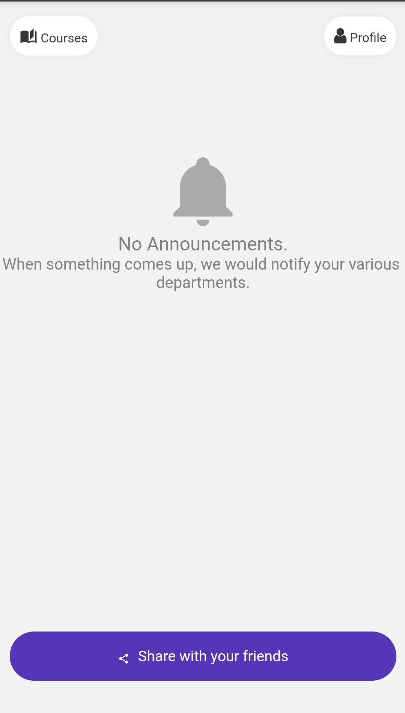

# AUOSIS Client

Cross-platfrom React Native app for Android, iOS and Web.

[Demo](https://auosis-online.web.app)

## Screenshots

**Register View**

**Home View**

## Features

* React Native app.
* Use *apollo-boost* lib for GraphQL requests.
* RN Notifications and calendar for lecture reminders.
* Push Notifications for news and remiders in firebase/Google Cloud Messaging (GCM)
